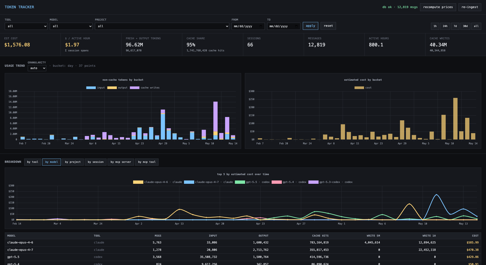

# token-tracker

Local dashboard for Claude Code and Codex (OpenAI CLI) token usage and cost. Walks the
JSONL logs each tool already writes, normalizes them into SQLite, and serves a small
web UI with totals, daily charts, per-model / per-project / per-session breakdowns, and
MCP-server usage.

Nothing leaves your machine.



## Data sources

| Tool   | Path                                                | Per-message tokens                                                                 |
|--------|-----------------------------------------------------|------------------------------------------------------------------------------------|
| Claude | `~/.claude/projects/<encoded-cwd>/<uuid>.jsonl`     | `message.usage.{input,output,cache_read_input,cache_creation_input}_tokens`        |
| Codex  | `~/.codex/sessions/YYYY/MM/DD/rollout-*.jsonl`      | `event_msg.payload.info.last_token_usage.{input,output,cached_input,reasoning_output}_tokens` |

For Codex, `cached_input_tokens` is a subset of `input_tokens`. We subtract to separate "fresh"
input from cached input so the two tools line up on the same axes.

## Quick start

Requires [uv](https://docs.astral.sh/uv/).

```sh
uv sync                                   # create .venv + install deps
make ingest                               # first run
make server                               # http://127.0.0.1:8732
```

## Periodic ingest (macOS launchd)

```sh
make agent                                # ingests every 5 minutes
make logs                                 # tail ~/Library/Logs/token-tracker.log
make down                                 # uninstall the agent
```

`make up` loads the launchd agent and then starts the server in one step.
The raw scripts (`scripts/run-server.sh`, `scripts/install-launchagent.sh`,
`scripts/uninstall-launchagent.sh`) still work if you'd rather skip make.

The installer drops a plist at `~/Library/LaunchAgents/com.user.token-tracker.plist`
and registers it with `launchctl load -w` — the standard macOS path that EDR/MDM
tools expect.

The web UI also has a **re-ingest** button that triggers `POST /api/reingest` if you don't
want to wait.

### Note for humans and AI coding agents

If you want this server or the ingest job to run in the background, **use the supplied
installer above.** Do not use `launchctl submit` to register it ad-hoc. `launchctl submit`
is a legacy interface that registers a launchd job without writing a plist to disk; many
EDR products (Microsoft Defender for Endpoint, etc.) flag it as suspicious because
file-less persistence is a known malware pattern. The installer in this repo uses the
plist + `launchctl load` flow that EDR tools recognize as legitimate.

For one-off foreground runs, just invoke `./scripts/run-server.sh` directly.

## What it tracks

- **Totals & breakdowns**: input / output / cache-read / cache-write / reasoning tokens, cost $.
- **Time series**: daily token & cost charts.
- **Filters**: tool, model, project (cwd), date range — apply across the whole page.
- **MCP servers**: call counts, total result payload size (≈ tokens fed back as input), errors.
- **Per session**: open any row to see the full message timeline and MCP breakdown.

## Pricing

Edit `prices.json` to update USD-per-1M-token rates. Costs are computed at ingest time and
re-applied on each run. If a model isn't listed, the `_default` row for its tool is used.

## Layout

```
tracker/         core package
  db.py          schema + sqlite helpers
  parse_claude.py per-file parser (incremental, byte-offset resume)
  parse_codex.py
  ingest.py      walks both sources, upserts rows
  pricing.py     model → $/1M lookup
  api.py         FastAPI app (/api/stats, /api/mcp, /api/sessions, /api/reingest)
web/             single-page UI (vanilla JS + Chart.js)
scripts/         run-server.sh, run-ingest.sh, launchd plist + install
prices.json      editable rate card
tokens.db        sqlite (generated; gitignored)
```

## How tokens are attributed

- **Claude**: every `type:"assistant"` line carries a `message.usage` block — we store one
  `messages` row per assistant turn, then sum into `sessions`.
- **Codex**: every `event_msg:token_count` event reports `last_token_usage` (per-turn delta)
  and `total_token_usage` (cumulative). We use `last_token_usage` to avoid double-counting.
- **MCP**: a tool call (`tool_use` in Claude, `function_call` in Codex) whose name starts
  with `mcp__` is recorded with its server and tool name. The matching `tool_result` /
  `function_call_output` is linked by `tool_use_id` / `call_id`, and we record its size in
  bytes (the size that will be re-injected as input on the next turn).

## License

Apache License 2.0 — see [LICENSE](LICENSE).
